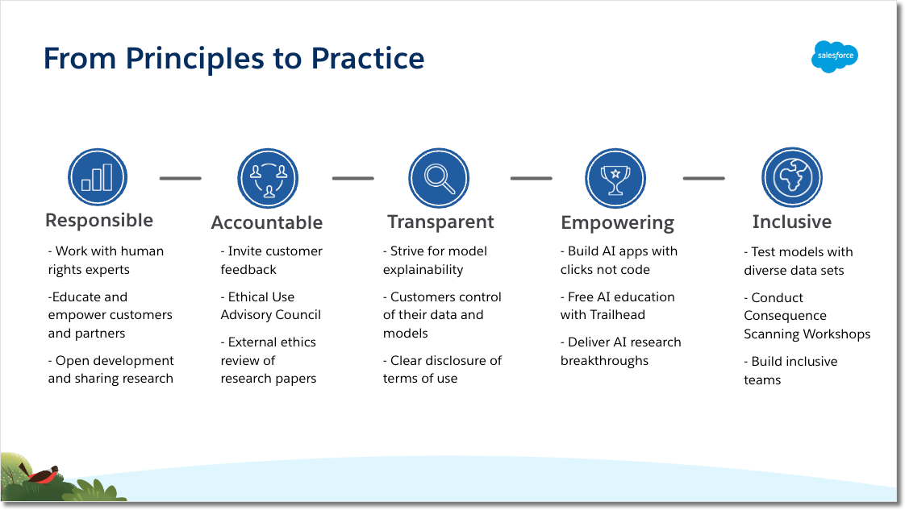

# Ethical Considerations of AI 🚀  
**Exam Weight: 39%**

---

## Meet Salesforce’s Trusted AI Principles

Em 2018, articulamos nossos **Trusted AI Principles** específicos para produtos, casos de uso e clientes da Salesforce. Após um ano de feedback de diversas equipes e aprovação da alta liderança, definimos cinco princípios fundamentais:

1. **Responsible**  
   — Protegemos direitos humanos, privacidade e seguimos padrões científicos rigorosos.  
   — Clientes devem usar IA em conformidade com nossa Acceptable Use Policy.

2. **Accountable**  
   — Prestamos contas a clientes, parceiros e sociedade.  
   — Recebemos feedback independente e mitigamos riscos continuamente.

3. **Transparent**  
   — Explicamos o “porquê” de cada recomendação ou previsão.  
   — Publicamos model cards e oferecemos explainability on-demand.

4. **Empowering**  
   — IA como complemento à capacidade humana: clicks, not code.  
   — Educação grátis via Trailhead e in-app guidance para uso responsável.

5. **Inclusive**  
   — Testamos modelos em datasets diversos e representativos.  
   — Promovemos diversidade em equipes e contextos de uso.

### From Principles to Practice

#### Responsible  
- Avaliamos “can we?” **e** “should we?” antes de lançar features.  
- Colaboramos com human rights experts e criamos ferramentas para detectar e mitigar bias (e.g., flagging protected attributes).  
- Segregamos, criptografamos e pseudonimizamos dados sensíveis; seguimos leis e padrões de qualidade.

#### Accountable  
- Mantemos Ethical Use Advisory Council e Customer Advisory Boards.  
- Participamos de grupos do setor (NIST, AI Advisory Committees, etc.).  
- Canais internos (Slack, corporate reporting) para reportar preocupações.

#### Transparent  
- Publicamos **Model Cards** com detalhes de criação, uso e performance.  
- Garantimos que clientes controlem seus dados e modelos em todos os momentos.

#### Empowering  
- Construímos apps de IA sem código (“clicks not code”).  
- Oferecemos Trailhead gratuito e ferramentas (disparate impact checks, auto model cards).  
- Pesquisa de ponta para manter clientes na vanguarda.

#### Inclusive  
- Workshops de Consequence Scanning e Build with Intention.  
- Equipes diversas para refletir múltiplas perspectivas.  
- Testes com dados representativos para evitar viés.

---

## Generative AI: 5 Guidelines for Responsible Development

### Generative AI at Salesforce  
- Integrada ao Einstein 1: ~200 bilhões de previsões diárias.  
- Aplicações em Sales, Service, Marketing, Commerce e IT.  
- Exploramos AI-generated code para devs e não-devs.

### Guidelines for Trusted Generative AI

1. **Accuracy**  
   – Enable customers to train on their own data.  
   – Cite sources, chain-of-thought explainability, highlight uncertainties.

2. **Safety**  
   – Bias, toxicity & robustness assessments; red teaming.  
   – PII protection; enforce sandbox publishing for code.

3. **Honesty**  
   – Respect data provenance & consent.  
   – Disclose AI-generated content (watermarks, labels).

4. **Empowerment**  
   – Balance full automation vs. human judgment.  
   – Generate ALT text; supercharge human workflows.

5. **Sustainability**  
   – Develop right-sized models to reduce carbon footprint.  
   – Smaller, well-trained models may outperform gigantes.

---

## AI Ethics Maturity Model

| Principle    | Practices                                                                 |
|--------------|----------------------------------------------------------------------------|
| Responsible  | Human rights experts; bias mitigation tools; open research                 |
| Accountable  | Customer feedback loops; Ethics Council; external reviews                 |
| Transparent  | Model explainability; customer data control; clear terms                  |
| Empowering   | Clicks-not-code apps; free AI education (Trailhead); research breakthroughs|
| Inclusive    | Diverse datasets; Consequence Scanning; inclusive team building           |

---

## Ethical Use of Technology in Salesforce

Salesforce publica nossos **Responsible Marketing Principles** e recomendações para personalização ética:

- **Transparência de Segurança**: Documentos públicos (SOC, ISO, PCI, C5, Cyber Essentials, TRUSTe).  
- **Consentimento & Transparência**: Informe dados coletados, finalidades e ofereça opt-out claro.  
- **Benefício em troca de dados**: Valor tangível para o cliente — conteúdo relevante, ofertas personalizadas.  
- **Intenção > Demografia**: Segmente por comportamento/interesse, não apenas atributos demográficos.  
- **Limitação de Frequência**: Defina throttling e message caps para evitar sobrecarga.

### Cenários de Mensagens Comportamentais

1. **Abandon Cart**: lembrete oportuno para concluir compra.  
2. **Abandon Browse**: cupom com explicação “vimos que você olhou X”.  
3. **Price Drop**: alerta de desconto + opção de feedback “já comprei / não me interessa”.  
4. **Novidades na Categoria Favorita**: “lançamos Y, achamos que você vai amar”.  
5. **Pós-compra**: instruções de uso, apps para tracking, cross-sell.  
6. **Real-Time Triggers**: eventos em tempo real (BOPIS, checkout) para experiência fluida.

---

## Learn Privacy and Data Protection Law (GDPR)

### Background & Scope  
– Direito fundamental à privacidade na UE desde 1995.  
– GDPR em vigor em 25 May 2018, harmonizando regras e aumentando multas (até €20 M ou 4% da receita).

### Key Terms

| Term                   | Definition                                                                       |
|------------------------|----------------------------------------------------------------------------------|
| **Data Subject**       | Pessoa natural identificada/identificável                                        |
| **Personal Data**      | Qualquer informação relacionada a uma pessoa                                    |
| **Sensitive Data**     | Origem étnica, opiniões políticas, saúde, biometria, etc.                        |
| **Processing**         | Qualquer operação com dados (coletar, armazenar, compartilhar…)                  |
| **Controller**         | Define finalidades e meios de processamento                                     |
| **Processor**          | Processa dados em nome do Controller                                            |
| **Pseudonymous Data**  | Reversível apenas com informação adicional separada e protegida                  |
| **Anonymous Data**     | Irreversível, não constitui personal data                                       |

### Major Changes

- **Legal Bases**: consentimento livre, específico e demonstrável, ou outras bases (contrato, obrigação legal).  
- **Processor Obligations**: contratos, segurança, compliance.  
- **Breach Notification**: até 72 h para DPA; titulares notificados se high risk.  
- **DPO Requirement**: para processamento em larga escala de dados sensíveis.  
- **Fines**: até €20 M ou 4% da receita global.  
- **Cross-Border Transfers**: BCRs, Standard Contractual Clauses, Codes of Conduct.  
- **Profiling Restrictions**: decisões automatizadas de alto impacto só com salvaguardas.  
- **Data Subject Rights**: access, rectification, erase (“right to be forgotten”), portability, objection.

### GDPR Principles

1. **Lawfulness, Fairness & Transparency** – aviso claro em coleta e uso.  
2. **Purpose Limitation** – dados usados só para fins explícitos.  
3. **Data Minimization** – coletar apenas o necessário.  
4. **Accuracy** – manter dados atualizados.  
5. **Storage Limitation** – reter só o tempo necessário.  
6. **Integrity & Confidentiality** – medidas técnicas e organizacionais (encryption, pseudonymization).  
7. **Accountability** – controller demonstra compliance, mantém registros e DPIAs.

### Implementation Steps

1. **Leadership Buy-in** & cross-functional team (IT, Legal, HR, Marketing).  
2. **Data Inventory & Mapping**: identificar fontes, tipos, fluxos.  
3. **Gap Analysis & Risk Assessment**: DPIAs para high-risk processing.  
4. **Policies & Processes**: privacy notices, consent management, processor contracts, incident response.  
5. **Training & Awareness**: para funcionários e fornecedores.  
6. **Ongoing Monitoring & Audits**: revisões periódicas e atualização de controles.  
7. **Documentation**: privacy notices, records of processing, DPIAs, BCRs/SCCs, DPO appointment.

### Salesforce’s Support

- **Data Processing Addendum** com SCCs e BCRs aprovadas pela UE.  
- **Trust & Compliance Documentation** para cada serviço (ISO 27001/18, SOC, PCI, C5, Cyber Essentials, TRUSTe).  
- **Customer Control**: dados pertencem ao cliente; configurações de privacidade by default and by design.

# California Consumer Privacy Act (CCPA) Basics

---

## Overview & Historical Context  
Nos EUA, o direito à privacidade tem raízes em decisões judiciais (e.g., *Griswold v. Connecticut*, 1965) e na Federal Privacy Act de 1974. Cada estado pode criar suas próprias leis de privacidade — a Califórnia lidera com a **California Consumer Privacy Act (CCPA)**, em vigor desde 1 Jan 2020.

---

## CCPA Origins & Timeline  
- **Petição Popular**: Eleitores californianos iniciaram uma proposta via referendo.  
- **Legislative Compromise**: Em 28 Jun 2018, a iniciativa foi substituída por um projeto de lei aprovado e sancionado.  
- **Effective Date**: 1 Jan 2020  
- **Employee Data**: Proteções adiadas até 1 Jan 2023 (único estado a incluir funcionários).

---

## Key Defined Terms  
| Term                     | Legal Definition                                                                                                                             | Example                                                                                           |
|--------------------------|----------------------------------------------------------------------------------------------------------------------------------------------|---------------------------------------------------------------------------------------------------|
| **Business**             | Organização com fins lucrativos que faz negócios na CA e que: (1) fatura ≥ US$ 25 mi/ano; (2) coleta PI de ≥ 100 000 indivíduos; ou (3) vende PI e > 50 % da receita. | Acme Inc. faturou US$ 40 bi e tem sede em São Francisco.                                           |
| **Consumer**             | Pessoa natural residente na CA (Título 18, §17014 CCR).                                                                                        | John, morador de São Francisco.                                                                   |
| **Personal Information** | Dados que identificam, descrevem ou podem ser razoavelmente associados a um consumidor ou domicílio.                                          | Nome, e-mail, CNH, histórico de compras, dados biométricos, geolocalização, inferências, etc.     |
| **Process**              | Qualquer operação com dados pessoais (coleta, uso, armazenamento, divulgação, etc.).                                                          | Acme usa CRM para coletar e analisar dados de leads.                                              |
| **Sell / Sale / Selling**| Compartilhar PI com outra empresa em troca de valor (monetário ou outro).                                                                    | Acme vende lista de clientes à Beta Inc. por US$ 100.                                              |
| **Service Provider**     | Processa PI em nome de uma Business, sob contrato escrito que limita o uso ao propósito comercial.                                           | Acme contrata Storage Services para armazenar dados de clientes.                                   |

---

## Scope & Applicability  
- **Who’s Protected**: Todos os **Consumers** californianos (incluindo funcionários, clientes, fornecedores).  
- **Who Must Comply**: Qualquer **Business** — em qualquer lugar — que faça negócios na CA e receba PI de residentes, se atender a qualquer critério de receita, volume de dados ou fonte de receita.

---

## Consumer Rights under CCPA  
1. **Right to Notice**  
   – Saber, no momento da coleta, categorias e finalidades de PI; identificar terceiros com quem a PI é compartilhada.  

2. **Right to Access**  
   – Solicitar:  
     - Categorias de PI coletadas;  
     - Fontes de coleta;  
     - Finalidades de uso;  
     - Terceiros que recebem PI;  
     - Dados específicos mantidos.  

3. **Right to Opt-Out of Sale**  
   – Solicitar que a Business pare de **Sell** suas PI a qualquer momento; link “**Do Not Sell My Personal Information**” deve estar visível no site.

4. **Right to Deletion**  
   – Pedir exclusão de PI coletada diretamente, salvo exceções (e.g., cumprimento de contrato, obrigações legais, detectação de fraudes, liberdade de expressão, defesa em litígio, usos internos esperados).

5. **Right to Non-Discrimination**  
   – Após exercer qualquer direito CCPA, o Consumer não pode ser cobrado ou receber serviços de qualidade inferior.

---

## Compliance Requirements  
- **Verification**: Autenticar identidade do consumidor antes de atender a qualquer solicitação.  
- **Timing**: Responder a todas as solicitações em até 45 dias (com possível extensão de 45 dias).  
- **Designated Methods**: Pelo menos dois canais de contato (e.g., telefone gratuito, e-mail, portal online).  
- **Privacy Notice**: Atualizar políticas públicas anualmente com todas as divulgações exigidas.  
- **Training**: Capacitar funcionários que lidam com solicitações e CCPA.  
- **Vendor Contracts**: Acordos escritos com **Service Providers** limitando uso de PI ao propósito contratado.  

---

## Implementing CCPA in Your Organization  
1. **Audit & Mapping**: Identifique fluxos de PI, sistemas de armazenamento e fornecedores.  
2. **Update Disclosures**: Políticas de privacidade, links “Do Not Sell…”, avisos no ponto de coleta.  
3. **Build Intake Process**: Portais/formulários para receber e gerenciar solicitações.  
4. **Authentication Procedures**: Protocolos para verificar identidade sem expor PI a terceiros.  
5. **Data Deletion & Portability**: Mecanismos para deletar e exportar PI de maneira segura.  
6. **Ongoing Monitoring**: Revisões regulares de processos e treinamentos.

---

## CCPA 2.0: CPRA Enhancements (Effective 1 Jan 2023)  
- **New Agency**: California Privacy Protection Agency (CPPA) para regulamentação e penalidades.  
- **Contractors**: Introduz categoria entre Service Providers e Third Parties.  
- **Sensitive Personal Information (SPI)**: Definição de dados de alto risco (SSN, conta bancária, localização precisa, dados de crianças).  
- **“Sharing” Opt-Out**: Direito de impedir uso de PI para “behavioral advertising” (mesmo sem troca de valor).  
- **Risk Assessments & Audits**: Exigência de avaliações de impacto e auditorias periódicas.  
- **Additional Consumer Rights**:  
  - **Correction**: Corrigir PI incorreta.  
  - **Limit Use & Disclosure**: Restringir tratamentos de SPI.  

---

> **Summary**: A CCPA/CPRA impõe transparência, direitos robustos aos consumidores e obriga empresas a implementar processos sólidos de privacidade, desde avisos até respostas a solicitações em 45 dias.  
